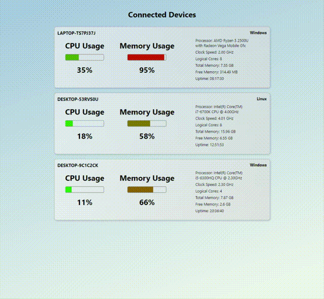

# Performance Monitor

Monitor network connection, uptime, and resource usage for multiple devices from one dashboard. Customize setup using environment variables or leave as-is to test locally.

## How to use

TLDR:

- Install dependencies
- Run monitor on device(s) you want to monitor
- Run server wherever you please
- Deploy dashboard and view from anywhere
